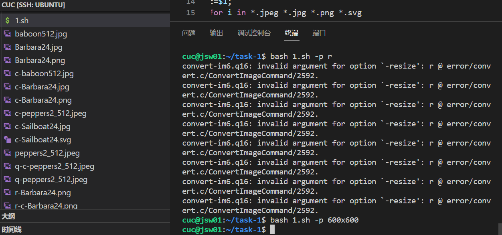

# 第四章：shell脚本编程基础（实验）

---

## 实验过程

---

#### 任务一 用bash编写一个图片批处理脚本，实现以下功能：

- [x] 支持命令行参数方式使用不同功能
- [x] 支持对指定目录下所有支持格式的图片文件进行批处理
- [x] 支持以下常见图片批处理功能的单独使用或组合使用
- [x] 支持对jpeg格式图片进行图片质量压缩
- [x] 支持对jpeg/png/svg格式图片在保持原始宽高比的前提下压缩分辨率
- [x] 支持对图片批量添加自定义文本水印
- [x] 支持批量重命名（统一添加文件名前缀或后缀，不影响原始文件扩展名）
- [x] 支持将png/svg图片统一转换为jpg格式图片

#### 功能实现

- 打开帮助文档

- 添加水印

- 将png/svg图片统一转换为jpg格式图片

- 对jpeg格式图片进行质量因子为q的质量压缩

- 对jpeg/png/svg格式图片在保持原始宽高比的前提下压缩r对应的分辨率

- 批量对文件名添加名为n的前缀

- 批量对文件名添加名为n的后缀

### 任务二-1：用bash编写一个文本批处理脚本，对以下附件分别进行批量处理完成相应的数据统计任务：（2014世界杯运动员数据）  

- [x] 统计不同年龄区间范围（20岁以下、[20-30]、30岁以上）的球员数量、百分比
- [x] 统计不同场上位置的球员数量、百分比
- [x] 名字最长的球员是谁？名字最短的球员是谁？
- [x] 年龄最大的球员是谁？年龄最小的球员是谁？

### 任务二-2：用bash编写一个文本批处理脚本，对以下附件分别进行批量处理完成相应的数据统计任务：

- [x] Web服务器访问日志
- [x] 统计访问来源主机TOP 100和分别对应出现的总次数
- [x] 统计访问来源主机TOP 100 IP和分别对应出现的总次数
- [x] 统计最频繁被访问的URL TOP 100
- [x] 统计不同响应状态码的出现次数和对应百分比
- [x] 分别统计不同4XX状态码对应的TOP 10 URL和对应出现的总次数
- [x] 给定URL输出TOP 100访问来源主机

---

## 问题与反思

---

- 在关闭任务未完成的新建终端后，在原终端继续下载上个未完成任务时，需要杀死上个下载任务的进程。

- 在脚本文件修改过代码后，一定要即时ctrl + s 进行保存操作，否则执行的还会是之前的代码。

- 备份是个好习惯，以防原文件被污染后难以找回的问题。对脚本测试前得新建测试文件，出错可以及时修改后再进行操作。

## 参考文件

- [E: Could not get lock /var/lib/dpkg/lock-frontend问题的解决方法](https://blog.csdn.net/weixin_44765402/article/details/109926221)

- [linux下使用convert命令修改图片分辨率](https://blog.csdn.net/mybelief321/article/details/9969949)

- [「效率」使用VScode连接远程服务器进行开发](https://zhuanlan.zhihu.com/p/141205262)

- [vscode连接虚拟机](https://www.cnblogs.com/hi3254014978/p/12681594.html)